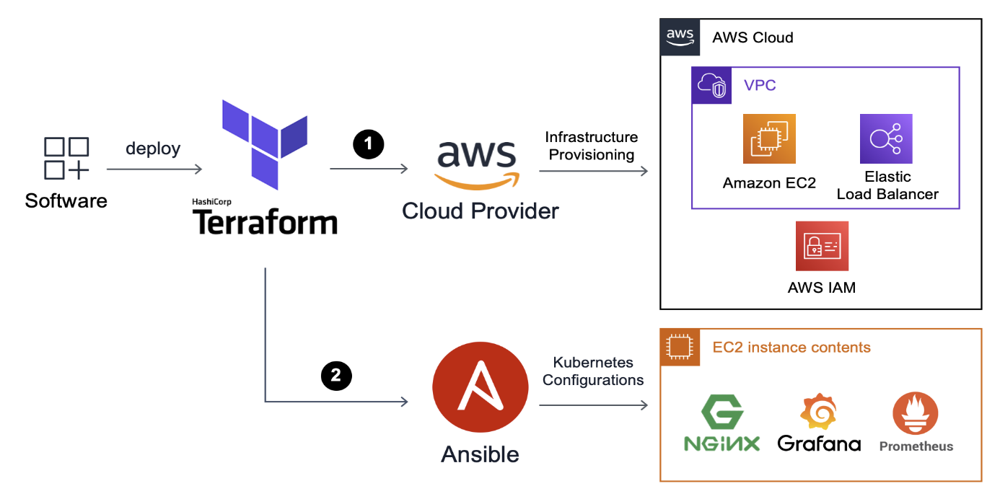
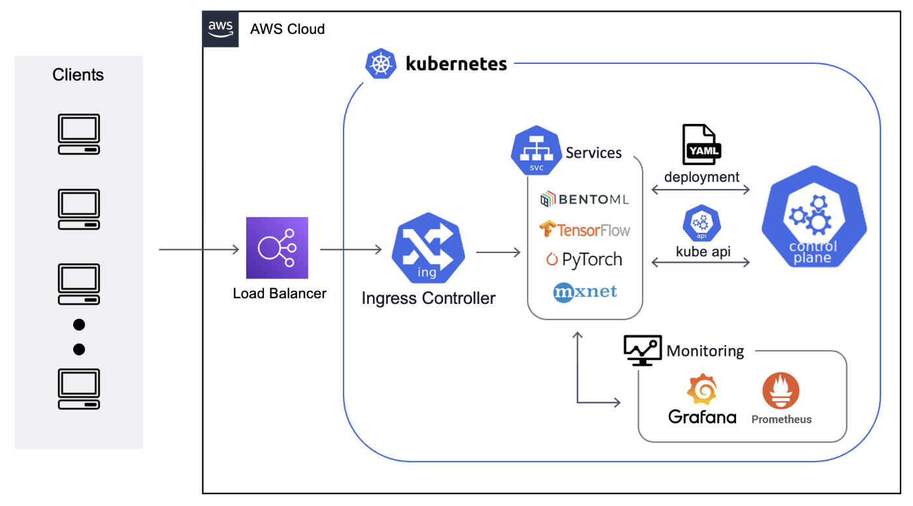
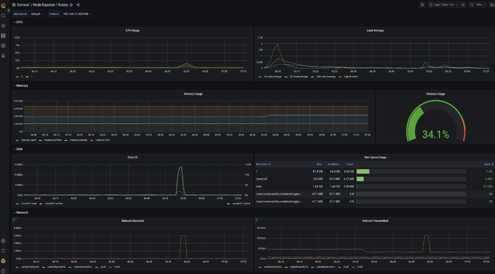
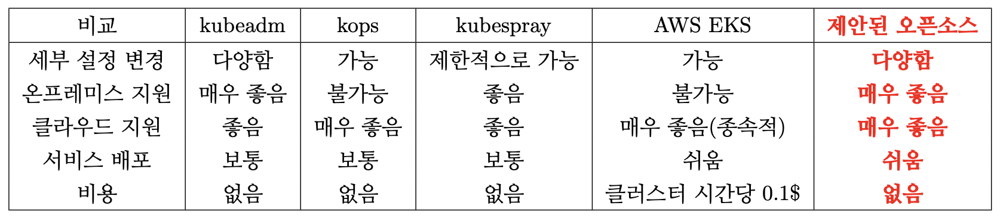

# 쿠버네티스 머신러닝 환경 배포 자동화 도구 오픈소스<br/>Open-Source Automated Software for Deploying Kubernetes Machine Learning Environment

## Introduction


```text
.
├── README.md
├── infra
│   ├── README.md
│   ├── ansible_hosts.txt
│   ├── assets
│   │   ├── ansible_k8s
│   │   │   ├── k8s_configure_monitoring.ansible.yml
│   │   │   ├── k8s_create_cluster.ansible.yml
│   │   │   ├── k8s_delete_nginx_ingress_controller.ansible.yml
│   │   │   ├── k8s_initial_setup.ansible.yml
│   │   │   └── k8s_join_nodes_to_k8s_cluster.ansible.yml
│   │   └── iam_policy
│   │       └── ingress_controller_policy.json
│   ├── create_ansible_hosts.py
│   ├── data.tf
│   ├── efs
│   │   ├── main.tf
│   │   ├── output.tf
│   │   └── variables.tf
│   ├── iam.tf
│   ├── k8s
│   │   ├── data.tf
│   │   ├── main.tf
│   │   ├── master_node
│   │   │   ├── master.tf
│   │   │   ├── output.tf
│   │   │   └── variables.tf
│   │   ├── output.tf
│   │   ├── variables.tf
│   │   └── worker_node
│   │       ├── output.tf
│   │       ├── variables.tf
│   │       └── worker.tf
│   ├── k8s_ansible.tf
│   ├── k8s_variable.tf
│   ├── main.tf
│   ├── output.tf
│   ├── variables.tf
│   ├── vpc
│   │   ├── nat.tf
│   │   ├── output.tf
│   │   ├── variables.tf
│   │   └── vpc.tf
│   └── vpc_variables.tf
└── mlserving
    ├── bentofile.yaml
    ├── bentoml_predict.py
    ├── bentoserve.yaml
    └── test.JPEG
```
- 이 오픈소스는 ML Model이나 Framework를 정하는 것 뿐으로 ML을 Kubernetes 환경에 배포하는 것을 목적으로 합니다.
- 현재 AWS 기준으로 제작되었으며 Azure, GCP와 같은 다른 Cloud vendor나 ESXi와 같은 Hypervisor, 이미 있는 기존 서버에 사용할 수 있도록 개발중입니다.
- ML Framework는 현재 bentoml을 사용할 수 있으며 tensorflow, torch 등 다양한 ML Framework와 Algorithm등을 Kubernetes에 바로 배포할 수 있도록 개발중입니다.
### 1. Kubernetes 환경 구축

- infra folder에 위치한 Source code 을 통해 kubernetes 환경을 구축할 수 있습니다.
- Aerraform과 Ansible을 사용했으며, terraform variables.tf에서 기본적인 내용들을 변경할 수 있습니다.
- 만약 좀더 세부적인 커스터마이징을 원하는 경우, 직접 Terraform과 Ansible 코드를 수정하여 배포할 수도 있습니다.
### 2. ML on Kubernetes

- infra folder내 Source code를 이용해 Kubernetes Cluster를 배포했으면, mlserving folder에 사전 정의된 ML Framework Template을 통해 위 아키텍쳐를 손쉽게 구성할 수 있습니다.
### 3. Monitoring

- 사전 정의된 ML Framework Template을 Kubernetes에 배포한 경우, 해당 Framework와 Kubernetes system을 Monitoring 하도록 Prometheus와 Grafana가 구성됩니다.
- 사용자는 Load Balancer 주소를 통해 Grafana에 접근할 수 있습니다.

### 기존 도구에 비해 가진 장점

- 사용자는 여러 클라우드에 최적화된 설정을 손쉽게 이용할 수 있습니다.
- 사용 환경(클라우드, 온프레미스)에 제약을 받지 않고 사용할 수 있습니다.
- 추가적인 비용이 소모되지 않으며, 머신러닝 서비스를 빠르게 배포할 수 있습니다.